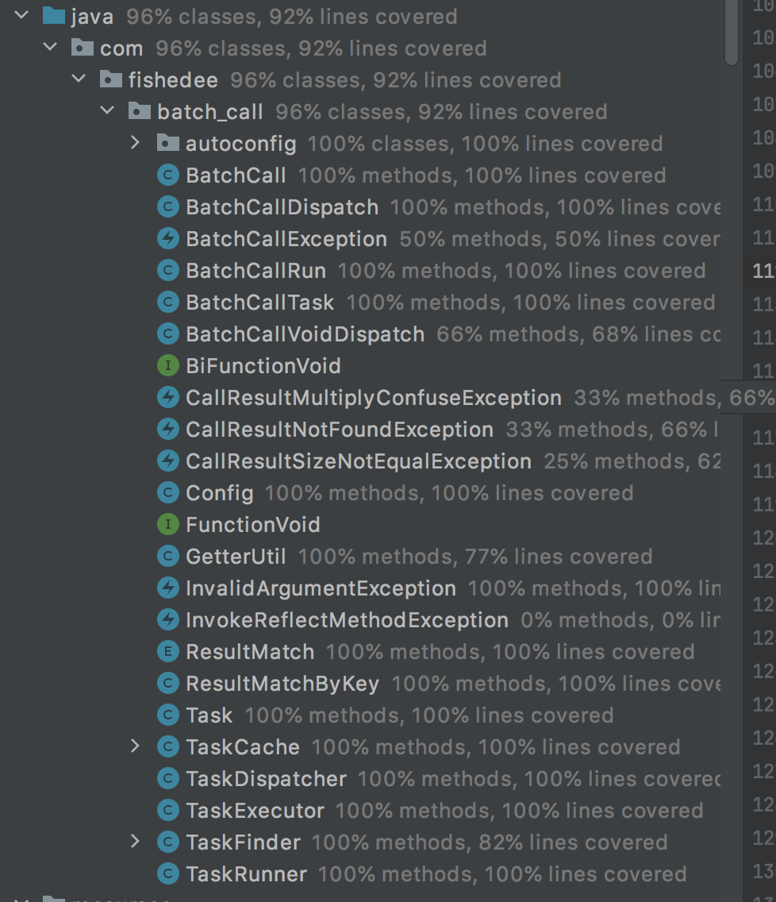

(https://jitpack.io/#fishedee/spring-boot-starter-batch-call)

# batch_call

在应用层join数据的场景，batch_call是比Java 8的stream接口更轻松的实现

Java的批量调用语法糖，功能：

* Lambda设计，接口为lambda的强类型设计，只要编译通过，就很少机会会用错。而且强类型设计允许了IDE方式的代码重构，而不需要修改BatchCall的调用代码
* 性能好，自动收集多嵌套层里面的数据，然后用FIFO队列实现理论上最佳的批量接口调用次数
* 支持按顺序还是按key分发数据
* 支持设置批量大小，可以控制每次调用接口的批量最大值，以保护后端接口
* 支出批量接口以后，先分组以后再分派结果的操作。
* 支持循环重复触发批量调用，在批量调用结果返回以后，接口可以返回的新数据让BatchCall继续同一个任务
* 支持泛型类和泛型方法的批量调用
* 支持可赋值类型，例如Key是int类型，而getBatch方法是Integer类型的
* 支持设置批量调用的结果允许是否为空数据，也允许设置当空数据时候的默认值
* 支持缓存，单任务内的缓存，这个在拉取树状数据和图状数据的时候相当有用
* 支持批量参数调用的返回值为void


完整的单元测试，整体的类覆盖率为96%，整体的行覆盖率为92%



TODO功能：

* 多线程，可以支持同时触发多个批量，以最大化效率

## 安装

```xml
<repositories>
    <repository>
        <id>jitpack.io</id>
        <url>https://jitpack.io</url>
    </repository>
</repositories>

<dependencies>
    <dependency>
        <groupId>com.github.fishedee</groupId>
        <artifactId>spring-boot-starter-batch-call</artifactId>
        <version>1.1</version>
    </dependency>
</dependencies>
```

在项目的pom.xml加入以上配置即可

## 使用

代码在[这里](https://github.com/fishedee/spring-boot-starter-batch-call/tree/master/spring-boot-starter-batch-call-sample)

```ini
spring.batch-call.enable = true
# 默认值
spring.batch-call.cache-enabled=false 
# 默认值
spring.batch-call.batch-size=1000
```

在application.properties中打开enable开关即可，其他选项可以不配置

### 1 顺序匹配

```java
@Data
public class CountryDTO {
    @Data
    public static class People{

        private Integer userId;

        private String name;

        private int level;

        public User getUser(){
            User single = new User();
            single.setId(this.userId);
            single.setName(this.name);
            single.setLevel(this.level);
            return single;
        }
    }

    private List<People> peopleList = new ArrayList<>();
}
```

我们有一个CountryDTO

```java
public class UserDao {

    @Autowired
    private JdbcTemplate jdbcTemplate;

    //从id转换为name
    public void insertBatch(List<User> users){
        for(User user :users){
            this.jdbcTemplate.update("insert into user(id,name,level) values(?,?,?)",user.getId(),user.getName(),user.getLevel());
        }
    }
}
```

然后有一个UserDao的insertBatch的方法（忽略里面的for循环实现）。我们期望要做的是将CountryDTO里面的People转换为User，然后批量插入进去

```java
@Autowired
private UserDao userDao;

@Test
public void sequeceMatchVoidReturnAndNoDispatch(){
    List<CountryDTO.People> insertPeopleList = new ArrayList<>();

    new BatchCallTask()
            .collectKey(CountryDTO.People.class,CountryDTO.People::getUser)
            .call(userDao,UserDao::insertBatch)
            //也可以选择用noDispatch
            .dispatch((CountryDTO.People people)->{
                insertPeopleList.add(people);
            })
            .run(countryDTO);
}
```
那么，我们可以这样做。

* 新建一个BatchCallTask
* collectKey，递归收集People，并用它的getUser转换为User对象
* call，调用UserDao的insertBatch方法
* dispatch，将返回结果分派回去，这里用了lambda表达式接收，因为insertBatch是没有返回值的，所以dispatch的闭包除了People对象外，也没有方法。

这就是默认的顺序匹配操作，一般是为了批量更新用的，实际应用中很少用到这种顺序匹配的操作

### 2 KEY匹配

```java
@Data
public class RecipeDTO {
    @Data
    @EqualsAndHashCode
    public static class Step{

        private String decription;

        private Integer userId;

        private String name;

        private int level;

        public void setUser(User user){
            this.name = user.getName();
            this.level = user.getLevel();
        }
    }

    private List<Step> stepList = new ArrayList<>();
}
```

我们更常用到的是这种场景，这是一个Recipe食谱，然后食谱里面有多个Step。由于Step表与User表是在不同的数据库中，不能进行join操作（互联网的业务也很少在数据库join了，都是在应用层join）。所以，我们希望在拉到RecipeDTO以后，自动拉取RecipeDTO.stepList下的User其他信息name和level。

```java
@Data
@AllArgsConstructor
@NoArgsConstructor
public class User {

    private Integer id;

    private String name;

    private int level;
}
```

这是User实体

```java
@Component
@Slf4j
public class UserDao {

    @Autowired
    private JdbcTemplate jdbcTemplate;

    //从id转换为name
    public List<User> getBatch(List<Integer> userIds){
        return this.jdbcTemplate.query("select * from user where id in "+ SqlUtil.getQuestionSql(userIds),
                SqlUtil.getArgumentArray(userIds),
                SqlUtil.getTypeArray(userIds,Types.INTEGER),
                new BeanPropertyRowMapper<>(User.class));
    }
}
```

这是UserDao的实现，也是很简单的

```java
@Autowired
private UserDao userDao;

@Test
public void noKeyMatch(){
    List<Integer> userIds = recipeDTO.getStepList().stream().
            map((single)->single.getUserId())
            .collect(Collectors.toList());

    Map<Integer,User> userMap = userDao.getBatch(userIds).stream()
            .collect(Collectors.toMap(e->e.getId(), e->e));

    recipeDTO.getStepList().forEach((step)->{
        step.setUser(userMap.get(step.getUserId()));
    });
}
```

一般情况下，我们需要用java 8 提供的流工作，可以写出以上的代码，仅仅需要一次的userDao的getBatch操作即可


```java
@Autowired
private UserDao userDao;

@Test
public void keyMatchAndDispatch(){
    new BatchCallTask()
        .collectKey(RecipeDTO.Step.class,RecipeDTO.Step::getUserId)
        .call(userDao,UserDao::getBatch,new ResultMatchByKey<>(User::getId))
        .dispatch(RecipeDTO.Step::setUser)
        .run(recipeDTO);
}
```

使用BatchCallTask我们也能达到以上的效果，注意，在call里面做了一个ResultMatchByKey

### 3 List，Set，Map下的自动嵌套收集

```java
public getData(){
    Map<Integer,RecipeDTO> hashMap = new LinkedHashMap<>();
    for( int i = 0 ;i != 10;i++){
        hashMap.put(i,recipeDTO);
    }
}
```

当然，实际应用会更加复杂，例如，我们的RecipeDTO是嵌套在可能是嵌套List，嵌套在Set，或者嵌套Map里面的。

```java
@Test
public void combineNoBatch() {
    Map<Integer, RecipeDTO> hashMap = new LinkedHashMap<>();
    for (int i = 0; i != 10; i++) {
        hashMap.put(i, recipeDTO);
    }

    //收集userId
    List<Integer> userIds = hashMap.values().stream().map((recipeDTO)->{
        return recipeDTO.getStepList().stream().map((single)->single.getUserId()).collect(Collectors.toList());
    }).reduce((a,b)->{
        a.addAll(b);
        return a;
    }).get();

    //批量调用
    Map<Integer,User> userMap = userDao.getBatch(userIds).stream()
            .collect(Collectors.toMap(e->e.getId(), e->e));

    hashMap.values().stream().forEach((recipeDTO -> {
        recipeDTO.getStepList().forEach((step)->{
            step.setUser(userMap.get(step.getUserId()));
        });
    }));
}
```

然后在嵌套外面一层map以后的RecipeDTO，用stream操作符就变成了以上的代码，复杂度要高很多。实际应用中，我们还会遇到3层嵌套的数据，代码就更复杂了。

```java
@Test
public void combine(){
    Map<Integer, RecipeDTO> hashMap = new LinkedHashMap<>();
    for (int i = 0; i != 10; i++) {
        hashMap.put(i, recipeDTO);
    }

    new BatchCallTask()
        .collectKey(RecipeDTO.Step.class,RecipeDTO.Step::getUserId)
        .call(userDao,UserDao::getBatch,new ResultMatchByKey<>(User::getId))
        .dispatch(RecipeDTO.Step::setUser)
        .run(hashMap);
}
```

而使用BatchCallTask，代码则可以跟原来的一样简单，我们只需要在run的输入参数中传递hashMap参数即可，其他代码保持不变。而且，BatchCallTask会自动收集多层嵌套里面的Step::getUserId来数据，最终只会执行一次的userDao.getBatch操作，和我们手写的代码一样高效率。

BatchCall的设计原则是，**尽可能以语义的方式声明怎样去Join数据，至于怎样实现效率是最佳的由库来实现，以达到易用性和高性能的平衡**

### 4 分组后派发数据

```java
@Data
public class ParkingDTO {

    @Data
    public static class Floor{
        private Integer driverId;

        private List<Car> carList;

        public void setCarList(List<Car> carList){
            this.carList = carList;
        }
    }

    private List<Floor> floorList = new ArrayList<>();
}
```

我们看一个新的例子，一个停车场ParkingDTO里面有多层Floor，每个Floor有一个司机，这个司机对应有多台车。我们的目标是让，批量拉取这些司机对应的汽车列表。

```java
@Data
public class Car {
    private int id;

    private int driverId;

    private String name;

    private String color;
}
```

这是数据库的对象存放，一个车，对应的司机id，和汽车名字，存放到数据库中。一台车只有一条记录，但一个司机可能对应多台车。

```java
@Component
public class CarDao {

    @Autowired
    private JdbcTemplate jdbcTemplate;

    //从id转换为name
    public List<Car> getByDriverId(List<Integer> driverIds){
        return this.jdbcTemplate.query("select * from car where driverId in "+ SqlUtil.getQuestionSql(driverIds),
                SqlUtil.getArgumentArray(driverIds),
                SqlUtil.getTypeArray(driverIds, Types.INTEGER),
                new BeanPropertyRowMapper<>(Car.class));
    }
}
```

然后有一个批量拉取接口，传入司机，传出多台车

```java
@Autowired
private CarDao carDao;

@Test
public void keyMatchAndDispatchListNoBatch(){
    List<Integer> driverIds = parkingDTO.getFloorList().stream().map((single)->single.getDriverId()).collect(Collectors.toList());

    Map<Integer,List<Car>> carsMap =  carDao.getByDriverId(driverIds).stream()
            .collect(Collectors.groupingBy(Car::getDriverId));

    parkingDTO.getFloorList().stream().forEach((single)->{
        List<Car> carList = carsMap.get(single.getDriverId());
        single.setCarList(carList!=null?carList:new ArrayList<>());
    });
}
```

这是stream的实现

```java
@Test
public void keyMatchAndDispatchList(){
    new BatchCallTask()
            .collectKey(ParkingDTO.Floor.class,ParkingDTO.Floor::getDriverId)
            .call(carDao,CarDao::getByDriverId,new ResultMatchByKey<>(Car::getDriverId))
            .groupThenDispatch(ParkingDTO.Floor::setCarList)
            .run(parkingDTO);
}
```

使用BatchCallTask，我们依然能轻松处理，将dispatch改为groupThenDispatch，接口依然是语义性的

### 5 批次大小，与打开缓存

```java
@Test
public void testDefaultBatch(){
    userDao.clearGetBatch2CallArgv();;

    new BatchCallTask()
            .collectKey(People3.class,People3::getUserId)
            .call(userDao,UserDao::getBatch2,new ResultMatchByKey<>(User::getId))
            .dispatch(People3::setUserRecursive)
            .setBatchSize(3)
            .run(peopleList);

     JsonAssertUtil.checkEqualStrict("[" +
                "[10001,10001,10001],"+
                "[10001,10002,10003],"+
                "[10002,10003,10002],"+
                "[10003,10002,10003],"+
                "[10002,10003,10002],"+
                "[10003,10002,10003],"+
                "[10002,10003]"+
                "]",userDao.getGetBatch2CallArgv());
}
```

默认在没有设置batchSize的时候，库默认最大batchSize为1000，所以每次都将所有数据批量调用一次接口。但是，通过setBatchSize设置了大小以后，BatchCall会自动将请求参数分组进行批量调用，保证每次分组的大小不超过3个。

### 6 树状数据的拉取

```java
@Data
public class Category {
    private int id;

    private int parentId;

    private String name;
}
```

我们有一个Category对象

```sql
create table category(
    id integer not null,
    name varchar(128) not null,
    parentId integer not null,
    primary key(id)
);

insert into category(id,name,parentId)values
(30001,'分类1',0),
(30002,'分类2',0),
(30003,'分类3',30001),
(30004,'分类4',30001),
(30005,'分类5',30003),
(30006,'分类6',30002),
(30007,'分类7',30006),
(30008,'分类8',30007);
```

这是数据库表的初始数据

```java
@Component
public class CategoryDao {

    @Autowired
    private JdbcTemplate jdbcTemplate;

    public List<Category> getBatch(List<Integer> ids){
        return this.jdbcTemplate.query("select * from category where id in "+ SqlUtil.getQuestionSql(ids),
                SqlUtil.getArgumentArray(ids),
                SqlUtil.getTypeArray(ids,Types.INTEGER),
                new BeanPropertyRowMapper<>(Category.class));
    }

    public List<Category> getByParent(List<Integer> parentId){
        this.callBatchArgv.add(parentId);
        return this.jdbcTemplate.query("select * from category where parentId in "+ SqlUtil.getQuestionSql(parentId),
                SqlUtil.getArgumentArray(parentId),
                SqlUtil.getTypeArray(parentId,Types.INTEGER),
                new BeanPropertyRowMapper<>(Category.class));
    }
}
```

然后我们有一个CategoryDao，可以批量拉取Category，以及某个Category下的子Category的两个接口。显然，这是一个拉取树形数据的问题。

```java
@Data
@NoArgsConstructor
@Slf4j
public class CategoryDTO {

    private int id;

    private int parentId;

    private String name;

    private List<CategoryDTO> children;

    public CategoryDTO(Category category){
        this.id = category.getId();
        this.parentId = category.getParentId();
        this.name = category.getName();
    }
}
```

为了不污染原来的Category代码，我们重建一个CategoryDTO对象，它仅仅是多了一个children字段而已

```java
@Data
public static class Req{
    private List<Integer> categoryIds;
}

@PostMapping("/getBatch")
public List<CategoryDTO> getBatch(@RequestBody  Req req){
}
```

那么，当我有这么一个getBatch的API接口的时候

```json
[
    {
        "id": 30002,
        "parentId": 0,
        "name": "分类2",
        "children": [
            {
                "id": 30006,
                "parentId": 30002,
                "name": "分类6",
                "children": [
                    {
                        "id": 30007,
                        "parentId": 30006,
                        "name": "分类7",
                        "children": [
                            {
                                "id": 30008,
                                "parentId": 30007,
                                "name": "分类8",
                                "children": []
                            }
                        ]
                    }
                ]
            }
        ]
    },
    {
        "id": 30003,
        "parentId": 30001,
        "name": "分类3",
        "children": [
            {
                "id": 30005,
                "parentId": 30003,
                "name": "分类5",
                "children": []
            }
        ]
    }
]
```

当我传入{"categoryIds":[30002,30003]}参数的时候，希望得到的是以上的结果

```java
@Data
@NoArgsConstructor
@Slf4j
public class CategoryDTO {

    private int id;

    private int parentId;

    private String name;

    private List<CategoryDTO> children;

    public CategoryDTO(Category category){
        this.id = category.getId();
        this.parentId = category.getParentId();
        this.name = category.getName();
    }

    public void setChildren2(List<CategoryDTO> children){
        this.children = children;
    }
}


private List<CategoryDTO> getCategoryChildren(int categoryId){
    List<Category> categories = this.categoryDao.getByParent(Arrays.asList(categoryId));

    List<CategoryDTO> initCategoryDTO = categories.stream().map(CategoryDTO::new).collect(Collectors.toList());

    initCategoryDTO.stream().forEach((category -> category.setChildren2(getCategoryChildren(category.getId()))));

    return initCategoryDTO;
}

@Test
public void getSpecifyCategoryAndSubCategoryNoBatch() {
    List<Category> categories = categoryDao.getBatch(Arrays.asList(30002, 30003));

    List<CategoryDTO> initCategoryDTO = categories.stream().map(CategoryDTO::new).collect(Collectors.toList());

    categoryDao.clearGetByParentCallArgv();

    initCategoryDTO.stream().forEach((category -> category.setChildren2(getCategoryChildren(category.getId()))));

    JsonAssertUtil.checkEqualStrict("[" +
            "[30002]," +
            "[30006]," +
            "[30007]," +
            "[30008]," +
            "[30003]," +
            "[30005]]",categoryDao.getGetByParentCallArgv());
}
```

用steam的代码是这样的，先拉取category自身，然后用forEach操作递归拉取他们的children数据。这样做，不仅代码可读性不太好，而且没有充分使用categoryDao.getByParent的批量特性，一共需要6次的批量接口，有几个节点，就需要批量拉取几次。

```java
@Data
@NoArgsConstructor
@Slf4j
public class CategoryDTO {

    private int id;

    private int parentId;

    private String name;

    private List<CategoryDTO> children;

    public CategoryDTO(Category category){
        this.id = category.getId();
        this.parentId = category.getParentId();
        this.name = category.getName();
    }

    public List<CategoryDTO> setChildren(List<Category> category){
        this.children = category.stream().map((single)->{
            return new CategoryDTO(single);
        }).collect(Collectors.toList());
        return this.children;
    }
}

@Test
public void getSpecifyCategoryAndSubCategory(){
    List<Category> categories = categoryDao.getBatch(Arrays.asList(30002,30003));

    List<CategoryDTO> initCategoryDTO = categories.stream().map(CategoryDTO::new).collect(Collectors.toList());

    categoryDao.clearGetByParentCallArgv();

    new BatchCallTask()
            .collectKey(CategoryDTO.class,CategoryDTO::getId)
            .call(categoryDao,CategoryDao::getByParent,new ResultMatchByKey<>(Category::getParentId))
            .groupThenDispatch(CategoryDTO::setChildren)
            .run(initCategoryDTO);

    JsonAssertUtil.checkEqualStrict("[" +
            "[30002,30003]," +
            "[30006,30005]," +
            "[30007]," +
            "[30008]]",categoryDao.getGetByParentCallArgv());
}
```

使用BatchCallTask接口我们不仅可以让代码如同之前的一样简单，而且，大大降低了批量调用次数，仅需4次的批量接口调用次数。调用次数与树的最大深度相同，而不是与树的节点数量相同，这里在内部主要是用了FIFO队列的广度优先遍历算法，能在理论上达到最低的批量调用次数。（当前的例子故意使用没有path字段的树设计，当表有path字段的时候，调用次数要更低，但是这需要数据库表设计上的协助优化）

另外要注意的是，setChildren方法的工作不仅需要设置children字段，还返回了children字段。这一段是递归触发批量调用的关键，如果dispatch方法中有返回值，该返回值会自动送入当前的BatchCallTask中继续触发批量调用的。如果dispatch方法中不返回数据，BatchCallTask是不会自动执行它的子节点数据的

## 总结

BatchCall不是要替代java8 stream功能，而是帮助开发者更好地处理应用层join数据的场景。

